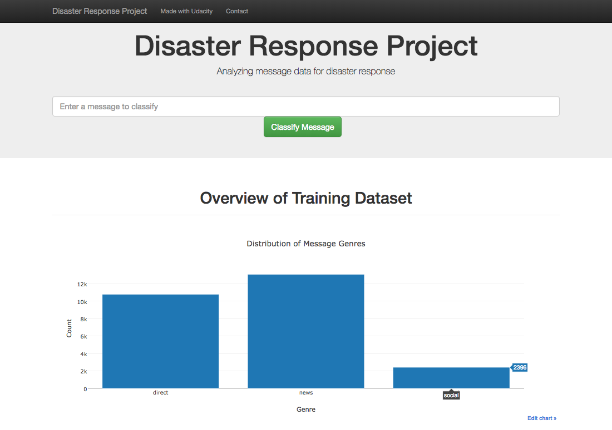

# Disaster Response Pipeline Project

### Objective
Analyze disaster data from Figure Eight to build a model for an API that classifies disaster messages. This project includes a web app where an emergency worker can input a new message and get classification results in several categories. The web app also displays visualizations of the data like the following:

### How to use
1. Run the following commands in the project's root directory to set up your database and model.

    - To run ETL pipeline that cleans data and stores in database
        `python data/process_data.py data/disaster_messages.csv data/disaster_categories.csv data/DisasterResponse.db`
    - To run ML pipeline that trains classifier and saves
        `python models/train_classifier.py data/DisasterResponse.db models/classifier.pkl`

2. Run the following command in the app's directory to run your web app.
    `python run.py`

3. Go to http://0.0.0.0:3001/

### Instruction

* app: Flask web app folder
* data: data resources folder
* models: model generator folder
* ipynb: jupyter notebooks for ETL and ML development

